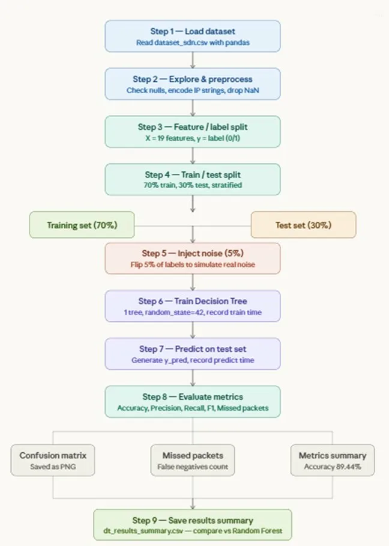
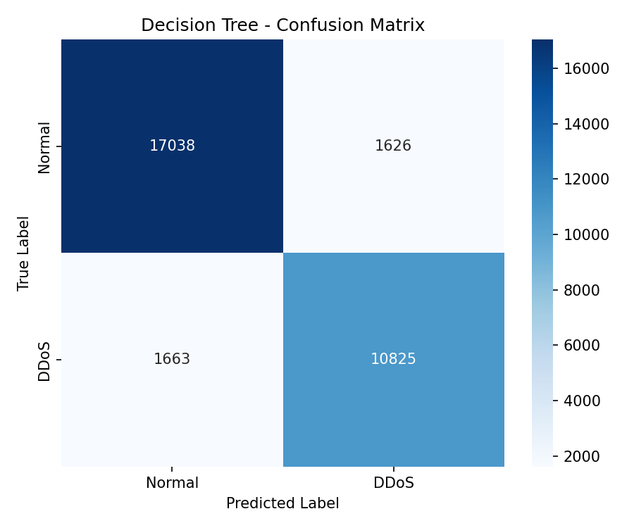

# DDoS Detection System - Decision Tree Classifier

A Machine Learning based DDoS attack detection system built in Python.
Trained on the SDN DDoS dataset and compared against a Random Forest
classifier under real-world noise conditions.

---

## Project Flowchart



---

## Dataset
- **Source:** [SDN DDoS Dataset — Kaggle](https://www.kaggle.com/datasets/aikenkazin/ddos-sdn-dataset)
- **Total records:** 104,345 network flow records
- **Normal traffic:** 63,561 records (label = 0)
- **Attack traffic:** 40,784 records (label = 1)
- **Features:** 23 columns including pktcount, bytecount, dur, Protocol

---

## Project Structure

| File | Description |
|---|---|
| `ddos_decisionTree_basic.py` | Phase 1 — basic clean data run, 80/20 split, no noise |
| `ddos_detection.py` | Phase 2 — final code with 5% noise, 70/30 split |
| `dt_confusion_matrix.png` | Confusion matrix from final run |
| `dt_results_summary.csv` | Results summary CSV |
| `flowchart.webp` | End-to-end pipeline flowchart |

---

## Methodology

### Phase 1 - Basic Clean Run (`ddos_decisionTree_basic.py`)
- 80/20 train/test split
- No noise added
- Dropped `src`, `dst`, encoded `Protocol` column
- Result: near perfect scores — revealed overfitting on clean lab data

### Phase 2 - Final Run with Noise (`ddos_detection.py`)
- Dropped redundant features: `pktrate`, `tot_kbps`, `tx_kbps`, `rx_kbps`
- **5% label flipping** applied to simulate real-world mislabelled traffic
- 70/30 train/test split with stratification
- Compared against partner's Random Forest implementation

---

## Results

### Phase 1 - Clean Data (80/20 split, no noise)

| Metric | Decision Tree |
|---|---|
| Accuracy (%) | 99.9952 |
| Precision (%) | 100.0000 |
| Recall (%) | 99.9877 |
| F1 Score (%) | 99.9939 |
| Missed Attacks | 1 |

> Near perfect scores on clean data indicate overfitting —
> the model memorized the lab dataset rather than learning general patterns.

### Phase 2 - Noisy Data (70/30 split, 5% label flip)

| Metric | Decision Tree | Random Forest |
|---|---|---|
| Accuracy (%) | 89.44 | 94.00 |
| Precision (%) | 89.44 | 94.00 |
| Recall (%) | 89.44 | 94.00 |
| F1 Score (%) | 89.44 | 94.00 |
| Train Time (s) | 0.7524 | 0.7935 |
| Pred Time (s) | 0.0077 | 0.0551 |

> Under identical noisy conditions Random Forest outperforms Decision Tree
> by 4.56% — proving its ensemble voting mechanism is more robust to
> real-world noise and mislabelled data.

---

## Confusion Matrix



| | Predicted Normal | Predicted Attack |
|---|---|---|
| **Actual Normal** | 17,038 ✅ | 1,626 ❌ |
| **Actual Attack** | 1,663 ❌ | 10,825 ✅ |

- **Missed attacks (False Negatives):** 1,663
- **Miss rate:** 13.32%
- **False alarms (False Positives):** 1,626

---

## Why Random Forest is Better

| Reason | Explanation |
|---|---|
| Overfitting resistance | 100 trees each see different data — no single tree memorizes everything |
| Noise robustness | Majority vote across 100 trees cancels out flipped labels |
| Higher Recall | Catches more attacks — fewer dangerous misses |
| Real-world reliability | 4.56% accuracy gap widens further with real traffic |

---

## How to Run
```bash
# Create virtual environment
python -m venv venv
venv\Scripts\activate

# Install dependencies
pip install scikit-learn pandas matplotlib seaborn numpy

# Run basic clean version
python ddos_decisionTree_basic.py

# Run final noisy version
python ddos_detection.py
```

---

## Technologies Used
- Python 3.13
- scikit-learn
- pandas
- numpy
- matplotlib
- seaborn

---

## Conclusion

Both models achieved ~100% accuracy on the clean SDN dataset, revealing
the limitation of evaluating ML models on controlled lab data. After
introducing 5% label noise to simulate real-world conditions, Decision
Tree dropped to 89.44% while Random Forest held at 94.00%. Combined with
Decision Tree's tendency to overfit and its vulnerability to noisy data,
Random Forest is the superior choice for real-world DDoS detection systems.

---

## Dataset Source
Dataset not included due to size.
Download from: https://www.kaggle.com/datasets/aikenkazin/ddos-sdn-dataset
